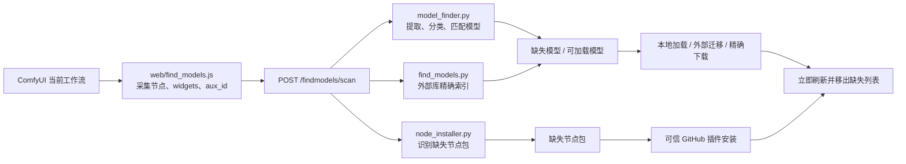

# ComfyUI_FindModels 项目交接文档

> 更新时间：2026-06-18
> 当前分支：`main`
> 当前项目版本：`1.26.4`
> 上一发布基线：`v1.25.0`
> 当前状态：代码清理、识别改进和 UI 重构已完成，运行文件已同步到实际 ComfyUI 插件目录
> 发布约束：只有用户明确要求时才提交或上传 GitHub

## 1. 项目目标

`ComfyUI_FindModels` 是 ComfyUI 自定义插件，目标是参考 ComfyUI 内置“工作流总览”的依赖识别方式，完成以下工作：

- 快速、准确识别当前工作流真正缺失的模型和自定义节点。
- 只显示尚未解决的依赖；已安装、已加载、已迁移的项目立即消失。
- 从 ComfyUI 已注册模型目录或用户选择的外部模型库精确匹配模型。
- 下载和迁移模型时严格使用 ComfyUI 或对应插件注册的官方模型分类目录。
- 为模型提供文件大小、可信下载来源、进度、速度、耗时、暂停、继续和取消。
- 根据工作流包元数据和可信映射识别缺失节点，并安全安装插件及其依赖。

## 2. 关键路径与仓库状态

| 项目 | 位置或状态 |
|---|---|
| 本地仓库 | `<workspace>/ComfyUI_FindModels` |
| 实际插件目录 | `<ComfyUI>/custom_nodes/ComfyUI_FindModels` |
| GitHub | `https://github.com/mclaughlinrosemary927/ComfyUI_FindModels` |
| ComfyUI 模型根目录 | `<ComfyUI>/models` |
| 外部模型库 | 用户在设置页选择，配置文件仅保存在本机 |
| 最新测试 | `104 tests passed` |

当前工作区未提交文件：

```text
PROJECT_HANDOFF.md
find_models.py
node_installer.py
tests/test_download_helpers.py
tests/test_node_installer.py
web/find_models.css
web/find_models.js
```

不要使用 `git reset --hard`、`git checkout --` 等会丢失当前修改的命令。

## 3. 整体架构



### 模块边界

| 文件 | 主要职责 |
|---|---|
| `model_finder.py` | 从工作流提取模型引用、分类、读取已注册模型、判断 installed/adaptable/missing |
| `find_models.py` | HTTP 路由、外部模型库索引、模型迁移、来源查询、下载任务、节点安装入口 |
| `node_installer.py` | 缺失节点包分组、可信仓库候选、插件安装、依赖冲突保护 |
| `web/find_models.js` | 工作流快照、自动扫描、右侧面板、加载/定位/下载/安装交互 |
| `web/find_models.css` | 原生右侧面板风格、四个独立标签页、响应式布局 |
| `tests/` | 模型识别、目录规则、下载安全、夸克、节点包和依赖保护回归测试 |

## 4. 不可改变的关键决策

### 4.1 模型识别

- 优先读取实时 widget、序列化 widget、嵌套自定义 widget 和工作流嵌入模型元数据。
- 支持动态加载器、多 LoRA、翻译控件、LLM、GGUF、ONNX 等自定义模型控件。
- 忽略 bypass/disabled 节点、自由文本、URL、Markdown、注释和非加载器中的泛化 `model` 字段。
- 同一模型合并显示一次，但保留全部引用节点。
- 不通过扩大模糊扫描范围修复漏报；每个真实案例必须增加回归测试。

### 4.2 installed、adaptable、missing

- 节点值与 ComfyUI 注册相对路径完全一致：`installed`，不显示。
- 文件名完全一致但节点保存了错误前缀或旧路径：`adaptable`，显示“加载本地模型”。
- 文件不存在：`missing`，显示外部候选或下载来源。
- 相似文件名不能自动替换，只能作为人工搜索参考。
- 加载成功后前端立即移除，并通过后续扫描确认，不能短时间再次出现。

### 4.3 官方模型目录

- 目标目录由 `folder_paths` 或具体插件注册的模型分类决定。
- 禁止使用工作流节点中的路径前缀推断目标目录。
- 下载和外部迁移都使用目标分类根目录和原始 `basename`，不得添加自定义前缀。
- `unknown` 分类禁止自动迁移或下载。
- 永不覆盖已有文件。

关键分类：

| 分类 | 目标目录 |
|---|---|
| `diffusion_models` | `models/diffusion_models`，兼容读取旧 `models/unet` |
| `loras` | `models/loras` |
| `text_encoders` | `models/text_encoders`，兼容读取 `models/clip` |
| `vae` | `models/vae` |
| `LLM` | 大小写敏感的 `models/LLM` |
| `instantid` | 对应插件注册的 `models/instantid` |
| `sams` | 对应插件注册的 `models/sams` |
| `ultralytics_bbox` | 对应插件注册的检测模型目录 |

### 4.4 外部模型库

- 扫描当前工作流时，优先按所需文件名和官方分类目录进行精确搜索。
- 分类目录搜索不到时才递归搜索整个外部库。
- 精确结果立即返回；完整索引在后台刷新。
- 支持多层目录和 `.safetensors`、`.gguf`、`.onnx`、`.pth`、`.pt`、`.bin` 等格式。
- 迁移前必须确认分类；迁移后清理 ComfyUI 文件名缓存并立即刷新 UI。

已验证案例：

- `diffusion_models/Wan/Wan2.1-InfiniteTalk_Single_Q6_K.gguf`
- `models/LLM` 下的主 GGUF 和 `mmproj` 文件
- 多 LoRA 节点中带中文或旧目录前缀的模型名

### 4.5 缺失节点与插件安装

- 缺失节点按工作流 `aux_id` 对应的插件包分组，不按单个节点类型重复显示。
- 模型引用不得混入缺失节点列表。
- 插件来源优先级：
  1. 工作流 `aux_id` 明确提供的 `owner/repository`。
  2. ComfyUI-Manager 官方节点映射。
  3. 用户明确输入的 HTTPS GitHub 仓库。
- 普通 GitHub 搜索结果不能自动安装。
- 安装时优先使用当前启动器配置的 Python、Git 和代理。
- 安装依赖前执行 dry-run，阻止带版本约束地修改 `torch`、`xformers`、`triton`、`onnxruntime` 等核心依赖。
- 安装后执行 `pip check`；出现新增依赖冲突时安装失败，不启用临时插件目录。

### 4.6 下载安全

- 只有远程文件名与缺失模型文件名完全一致时才允许直接下载。
- 只接受允许列表中的 HTTPS 主机，拒绝未知主机、HTML 错误页和 Git LFS 指针。
- 下载目标必须是已注册的官方模型分类目录。
- 支持暂停、Range 续传、重试、取消、速度、已耗时和剩余时间。
- 面板关闭后任务继续；重新打开后从后端任务状态恢复。
- 两个固定夸克分享库：
  - `https://pan.quark.cn/s/fb913d649b18`
  - `https://pan.quark.cn/s/4680ac866516`
- 夸克公开分享受权限、token 和限速影响；可选登录 Cookie 仅保存在本地忽略文件中，绝不能提交。
- 夸克失败时回退到文件名完全一致且可验证的 Hugging Face/Civitai 来源。

## 5. 已完成功能

### 模型

- checkpoints、LoRA、VAE、ControlNet、text encoders、diffusion models、embeddings、upscale、检测模型、LLM 等分类识别。
- WanVideo、FantasyTalking、InfiniteTalk、多 LoRA 和 Llama-cpp/mmproj 案例。
- 本地精确文件名匹配和路径修正。
- 外部模型库多层精确搜索、大小显示和官方目录迁移。
- 迁移、下载或加载后立即移出缺失列表。
- 模型名复制、引用节点定位和下载来源查询。
- 本地模型候选仅接受不区分大小写的完全同名文件，固定显示为 `99%`；相似名不再提供自动加载。
- 未知分类会结合节点 `INPUT_TYPES`、动态 `folder_paths` 注册、本地候选分类和外部目录提示解析官方目录。

### 节点

- 读取 `aux_id`/`ver`，按插件包分组。
- 定位节点、重新查找候选、GitHub 搜索、自定义链接安装。
- `requirements.txt` 安装开关和依赖冲突保护。
- 节点安装任务显示分阶段绿色进度条。
- 已验证 `AudioDurationToFrames` 可归入 `syq890610-crypto/Comfyui-Mk-tools`。

### UI 与生命周期

- 顶部运行栏“查找模型”按钮。
- 默认不弹出，点击后挂载到 ComfyUI 原生右侧 SplitterPanel。
- 缺失模型、缺失节点、下载任务、设置四个独立页面。
- 关闭后可再次打开，下载任务不停止。
- 工作流切换触发快速本地扫描，随后异步补充外部候选信息。
- 夸克设置页动态显示两个分享库状态并支持连接检测；搜索会分页递归至深层目录。

## 6. 本轮未提交优化

本轮优化已经完成并同步到实际插件目录，但尚未提交 Git：

- 删除 3 个无调用 Python 助手函数。
- 删除 4 个前端未使用的旧 HTTP 兼容接口。
- `install_market_plugin` 重命名为准确的 `install_plugin`。
- 删除无效 `panelUserOpened` 状态和 `render` 的无效参数。
- 删除错误的第三个夸克兼容链接，仅保留用户指定的两个分享库。
- 将多轮叠加的 CSS 重写为单一规则集，删除重复选择器和相互覆盖样式。
- 更新测试名称和夸克链接精确断言。
- 净减少约 121 行代码。

实际插件目录已同步以下运行时文件，并完成 SHA-256 一致性检查：

```text
find_models.py
node_installer.py
web/find_models.js
web/find_models.css
```

## 7. 重要文件修改记录

### `model_finder.py`

- 建立显式模型 widget、动态 widget 和嵌套值提取规则。
- 增加官方分类别名和插件动态分类。
- 支持 LLM/mmproj、InfiniteTalk、检测模型、多 LoRA。
- 严格区分精确路径、精确文件名和相似候选。

### `find_models.py`

- 实现扫描、外部目录选择、迁移、来源查询、下载任务和节点安装路由。
- 外部库按当前缺失文件名进行快速精确索引。
- 目标目录统一从 ComfyUI 注册分类解析。
- 下载支持校验、续传、进度和失败回退。
- 本轮删除旧同步下载、单任务进度和旧外部目录读写接口。

### `node_installer.py`

- 按 `aux_id` 分组缺失节点包。
- 可信 GitHub 仓库候选及 URL 验证。
- 安装环境解析、依赖 dry-run、核心依赖保护和 `pip check`。
- 本轮统一安装函数命名为 `install_plugin`。

### `web/find_models.js`

- 采集实时工作流和前端注册节点。
- 快速扫描、防过期请求覆盖、工作流切换监听。
- 原生右侧面板挂载和关闭恢复。
- 模型加载、外部迁移、来源查询、下载控制、节点安装。
- 本轮删除无效面板状态及无效渲染参数。

### `web/find_models.css`

- 重新整理为单一 344 行规则集。
- 保留原生右侧停靠、完整模型名、四标签页、下载状态和响应式布局。
- 删除历史 UI 版本遗留的重复选择器和覆盖链。

### 测试

- `tests/test_model_finder.py`：识别、分类、路径适配、多 LoRA、LLM。
- `tests/test_download_helpers.py`：官方目录、外部库、下载校验、夸克、任务状态。
- `tests/test_node_installer.py`：包分组、可信仓库、依赖保护。

## 8. 当前待办事项

### P0：真实 ComfyUI UI 回归

- 重启 ComfyUI 并执行 `Ctrl+F5`，确认新 CSS 和 Python 路由生效。
- 验证右侧原生面板打开、关闭、再次打开和 SplitterPanel 拖动。
- 验证四个标签页仅显示各自内容，长模型名完整换行。
- 验证本地路径适配、外部迁移、下载完成后缺失项立即消失且不反复出现。
- 验证下载暂停、继续、速度、耗时和剩余时间。

### P1：真实工作流案例持续对齐

- 对用户后续提供的每个漏报或误报工作流，先提取真实 widget/metadata，再添加回归测试。
- 继续与内置“工作流总览”的缺失模型、缺失节点结果逐案例对比。
- 不引入泛化字符串扫描来掩盖单个加载器的识别问题。

### P1：插件更新失败回滚

- 新插件在临时目录安装失败时已经清理。
- 已存在插件执行 `git pull` 后，如果依赖安装失败，目前不会自动回退 Git 提交。
- 后续可增加更新前记录提交、失败后非破坏性回退机制。

### P2：提交与发布

- 用户确认真实 ComfyUI 回归通过后，检查 diff、更新版本号、提交并上传 GitHub。
- 本地路径、外部目录配置、Cookie、缓存和下载临时文件不得提交。

## 9. 验证命令与当前结果

```powershell
cd <workspace>/ComfyUI_FindModels
python -m unittest discover -s tests
python -m py_compile find_models.py model_finder.py node_installer.py __init__.py
node --check web\find_models.js
git diff --check
git status --short
```

当前结果：

```text
Ran 104 tests
OK
Python compile: passed
JavaScript syntax: passed
CSS brace validation: passed
git diff --check: passed
```

## 10. 下一会话建议执行顺序

1. 阅读本文件。
2. 执行 `git status --short`，保留当前未提交修改。
3. 执行第 9 节完整测试。
4. 核对实际插件目录中的运行时文件与仓库一致。
5. 优先完成第 8 节 P0 真实 ComfyUI 回归。
6. 遇到漏报/误报时添加最小回归测试后再修改识别规则。
7. 修改后重新同步实际插件目录并校验文件哈希。
8. 只有用户明确要求时才提交或上传 GitHub。

## 11. 验收标准

- 与“工作流总览”的缺失依赖结果一致，或差异有明确技术理由。
- 真正缺失的模型和节点全部显示，无注释、模型或前端辅助节点误报。
- 本地已存在但节点路径错误的模型可一键加载。
- 加载、迁移或下载后立即消失，后续扫描不重新出现。
- 下载和迁移严格进入官方注册目录，不添加多余文件名前缀。
- 下载文件名完全一致、来源可信、进度可恢复。
- 插件安装不破坏 ComfyUI 核心 Python 环境。
